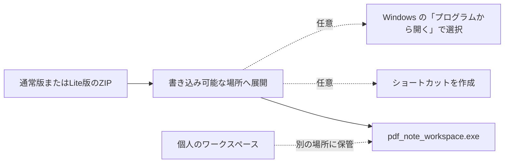

# ZIP 配布のセットアップ

対象アプリ版: 0.8.57

このソフトはインストーラーを使いません。ZIP を展開して使います。管理者権限、ネットワーク接続、既定アプリの自動変更は必要ありません。



## 0. GitHub から入手する

GitHub のアカウントや Git の知識は必要ありません。リポジトリの「Releases」（または右側の「Releases」欄にある最新版）を開き、使いたい版の **Assets** から ZIP を 1 つダウンロードします。画面の表示が異なる場合は、「Releases」の一覧から最新版を開いて **Assets** を展開してください。

`Source code (zip)` と `Source code (tar.gz)` は開発用のソースコードです。アプリを使うための ZIP ではないので、選びません。

## 1. 通常版と Lite版を選ぶ

ZIP は通常版と Lite版のどちらか一方を選んで展開します。二つの配布フォルダを混ぜたり、一方から DLL や `libreoffice` フォルダだけを移したりしないでください。

| 版 | 選ぶとき | Office ファイルの扱い |
| --- | --- | --- |
| 通常版 | `.docx` / `.pptx` をアプリ内で PDF にして使いたい | 同梱 LibreOffice でローカル変換できる。変換結果は必ず確認する |
| Lite版 | PDF を既に持っている、または小さい配布物を使いたい | Office-to-PDF 変換は使えない。変換済み PDF を取り込む |

Lite版は起動後のウィンドウ名に `Lite` と表示されます。Microsoft Office やオンライン変換サービスはどちらの版でも使用しません。

## 2. 展開する

1. ZIP ファイルを右クリックし、「すべて展開」を選びます。
2. `ダウンロード` フォルダの中ではなく、書き込み可能で分かりやすい場所へ展開します。例: `ドキュメント\PDF Note Workspace`。
3. ZIP の中を直接開いた状態では起動しません。展開後のフォルダから `pdf_note_workspace.exe` を起動します。

通常は `pdf_note_workspace.exe` を使います。閲覧だけなら `readonly_viewer.exe` を使えます。

### 配布フォルダの中身を移動しない理由

配布フォルダには、実行ファイルのほかに、PDF表示用の `pdfium.dll`、C++ runtime の DLL、通常版では Office 変換用 LibreOffice runtime など、アプリが動作するための部品が入っています。Windows の標準的な DLL 読み込みは実行ファイルのあるフォルダを基準に行われるため、EXE と DLL を別々のフォルダへ移すと起動や PDF 表示に失敗することがあります。Lite版に LibreOffice runtime がないのは仕様です。

`pdf_workspace_setup.json` は初回起動時のワークスペースを記録する配布用設定で、実行ファイルのあるフォルダを基準に読み込まれます。これも別の場所へ移したり、名前を変えたりしないでください。個人の PDF、ノート、注釈などの作業データは、配布フォルダとは別のワークスペースに置きます。

ファイルを整理したい場合は、配布フォルダの中身を分類して移動するのではなく、配布フォルダ全体を分かりやすい場所へ置き、ショートカットから起動してください。ショートカットは配布物をコピーするものではなく、元のフォルダにある EXE を直接起動するため、DLL や設定ファイルの場所を保てます。

## 3. 作業データを守る配置

### ワークスペースとは

ワークスペースは、あるまとまりの作業データを置くローカルフォルダです。PDF、ノート、注釈を同じ場所で扱い、アプリはその中に編集途中の保護、バックアップ、復元に必要な `__resource__` フォルダも作ります。アプリを更新・展開し直しても、ワークスペースを別の場所にしておけば、自分の作業データはそのまま使えます。

### どのフォルダを選ぶか

ローカルドライブ上にあり、書き込みできて、後から場所を思い出せるフォルダを選びます。授業、資料、案件など、あとで一緒に開いたりバックアップしたりしたい単位ごとに分けると管理しやすくなります。

| 作業のしかた | おすすめのワークスペース例 | 選ぶ理由 |
| --- | --- | --- |
| 1つの授業・講義で使う | `C:\PDF Note Workspace Data\数学I` | 関連する PDF・ノート・注釈をまとめて開け、授業単位でコピーやバックアップができる |
| 複数の案件・科目で使う | `C:\PDF Note Workspace Data\` の下に案件・科目ごとのフォルダ | 別の作業を混ぜず、必要なまとまりだけを持ち出したり復元したりできる |
| まず試す | 展開フォルダ内の `sample_workspace` を別の場所へコピーしたフォルダ | 同梱サンプルを残したまま、試した内容を分けて確認できる |

`ダウンロード` フォルダ、アプリの展開フォルダ、ネットワーク上の共有フォルダは、普段のワークスペースには選びません。ダウンロードや展開先は更新・整理時に消してしまいやすく、ワークスペースはローカルドライブ上で使うためです。ジャンクションやシンボリックリンクのフォルダも選べません。

### 作成して開く

1. エクスプローラーで、上の例のような新しい空フォルダを作ります。
2. アプリの「ワークスペースを開く...」から、そのフォルダを選びます。
3. 以後は PDF、ノート、注釈をそのワークスペース内で扱います。アプリが作る `__resource__` は、編集途中や復旧に必要なので、手動で移動・削除しません。

同梱の `sample_workspace` は初回確認用です。自分の作業用に使う場合は、先に別の場所へコピーしてください。アプリが PDF 原本へ直接書き込むことはありません。大きな編集の前や、外部へ渡す前には、`Ctrl+S` で保存してからワークスペース全体をコピーしておくと安心です。

## 4. ショートカットを作る（任意）

### デスクトップ

`pdf_note_workspace.exe` を右クリックし、「ショートカットの作成」を選びます。作成先を尋ねられた場合は「はい」を選ぶと、デスクトップに置けます。

ショートカットの作成後は、ショートカットをデスクトップへ移動します。`pdf_note_workspace.exe` 本体や、同じフォルダにある DLL・`pdf_workspace_setup.json` は移動しません。

### スタートメニュー

作成したショートカットを右クリックし、「スタートにピン留めする」を選びます。Windows の表示によって項目が見つからない場合は、「その他のオプションを表示」の中を確認してください。

ショートカットは任意です。削除してもアプリやワークスペースは削除されません。

## 5. .clro / .clrop / PDF を開くアプリとして選ぶ（任意）

関連付けは利用者が Windows 上で選びます。このソフトは既定アプリを自動変更しません。

1. 対象ファイルを右クリックし、「プログラムから開く」>「別のプログラムを選択」を開きます。
2. 「この PC で別のアプリを探す」を選び、展開先の実行ファイルを指定します。
3. 必要なときだけ「常にこのアプリを使って開く」を選びます。選ばなければ、その1回だけ開きます。

| 対象 | 選ぶ実行ファイル |
| --- | --- |
| `.clro` | `readonly_viewer.exe` |
| `.clrop` | `readonly_viewer.exe` |
| `.pdf` | `readonly_viewer.exe` |

PDF の既定アプリを変えたくない場合は、PDF には「常にこのアプリを使って開く」を選びません。

## 6. 更新する

1. アプリを終了します。
2. 新しい ZIP を別の新規フォルダへ展開し、起動できることを確認します。
3. 個人のワークスペースが展開先とは別なら、そのまま新しいアプリから開けます。
4. 古い展開フォルダは、個人の PDF・ノート・注釈・`__resource__` が含まれていないことを確認してから削除します。

個人の作業データをアプリの展開先に置いている場合は、更新や削除の前にワークスペース全体を別の場所へコピーしてください。

## 7. 削除する

アプリを終了してから、展開したアプリのフォルダだけを削除します。個人のワークスペースを別の場所に置いていれば、そのデータは残ります。

残ったショートカットは手動で削除できます。関連付けを戻す必要がある場合は、対象ファイルを右クリックして「プログラムから開く」から別のアプリを選び直します。

## 8. 配布内容を確認する（任意）

展開フォルダに `checksums.sha256` がある場合は、必要に応じて PowerShell でファイルの SHA-256 を確認できます。

```powershell
Get-FileHash .\pdf_note_workspace.exe -Algorithm SHA256
```

表示された値を `checksums.sha256` の同じファイル名の行と比較します。値が一致しない場合は起動せず、ZIP を再取得して展開し直してください。
