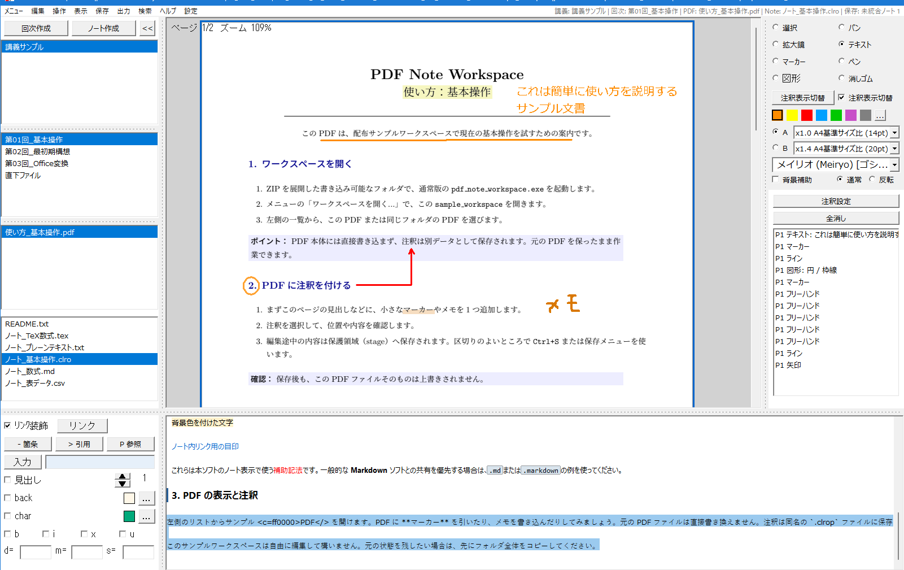

# 使い方

対象アプリ版: 0.8.60

この文書では、PDF とノートを安全に扱い始めるための基本操作を案内します。迷ったときは、まず保存せずに画面の表示とファイル名を確認してください。

*（PDF閲覧・非破壊注釈・手書きメモ・ノート編集を1画面で行えるメイン操作画面）*

## 1. 最初にすること

1. 配布物を、書き込み可能なフォルダへ展開します。ZIP の中から直接起動しないでください。展開、ショートカット、関連付け、更新の詳細は [How_to_Setup.md](How_to_Setup.md) を参照してください。
2. 通常は `pdf_note_workspace.exe` を起動します。PDF やノートを閲覧だけしたい場合は、`readonly_viewer.exe` を使えます。
3. 初回確認には `sample_workspace/` を使えます。自分の資料で作業を始める前に、必要ならこのフォルダを複製して別名のワークスペースとして使ってください。

`readonly_viewer.exe` は、同梱文書や一般的なテキストを確認するための簡易ビューアです。PDF への注釈やノート編集には通常版を使います。

## Office ファイルや画像を PDF にする

通常版では `.docx` と `.pptx` を PDF へ変換して、現在のワークスペースの PDF 欄へ取り込めます。メニューの「LibreOfficeでDOCX/PPTXをPDFに変換（試験的）...」を使うか、ワークスペースへファイルをドロップします。ドロップ時は対象一覧と確認が表示され、「変換する」を選んだ場合だけ変換します。

また、画像ファイル（`.png` / `.jpg` / `.jpeg`）も 1 ページの PDF へ変換してワークスペースへ取り込めます。PDF 一覧の右クリックメニューから「画像をPDFに変換（1ページPDF作成）」を選ぶか、ファイルをドロップして取り込みます。元の画像ファイルは変更せず、画像の解像度・サイズに基づき 1 ページの PDF を生成します。

変換は同梱 LibreOffice やローカルライブラリを使う完全なローカル処理です。Microsoft Office や外部オンライン変換サービスには接続しません。元の DOCX/PPTX や画像は変更せず、変換結果の PDF を確認してから使ってください。Office 文書のフォント、図形、数式などによっては、見た目が元の Office 文書と完全には一致しないことがあります。

Lite版はウィンドウ名に `Lite` と表示され、Office-to-PDF 変換 runtime を含みません。Lite版へ DOCX/PPTX をドロップしても変換・取込みは行わず、使えないことを表示します（画像からの 1 ページ PDF 作成および既存の PDF の取り込みは利用できます）。

`.md` の Mermaid flowchart は、ビューアで「図表  Ctrl+4」を選ぶと図として確認できます。初期対応は `flowchart` / `graph` の基本的なノード、矢印、`subgraph` に限られます。ノードはラベル量に応じて大きさを調節します。1つの文書に対応済みの図表が複数ある場合は、まとめて表示します。図表上ではマウスホイールで上下へ移動し、`Ctrl` を押しながらホイールを回すと縮小・拡大できます。右クリックすると専用の図表ウィンドウを開き、拡大・縮小・等倍ボタンとスクロールで詳しく確認できます。未対応の構文やエラーがある場合は、Raw または装飾表示で原文を確認してください。図表の表示は読み取り専用で、Markdown ファイルを変更・保存しません。

## 2. ワークスペースを開く

メニューの「ワークスペースを開く...」から、作業フォルダを選びます。PDF、ノート、注釈はワークスペース内でまとめて扱います。

PDF 本体には直接書き込まず、注釈は別データとして保存します。そのため、元の PDF を保ったまま注釈作業ができます。

作業用フォルダは、授業・資料・案件など、あとで見分けられる単位で分けると管理しやすくなります。アプリが管理する `__resource__` フォルダは、復旧や編集途中の保護にも使われるため、通常は手動で移動・削除しないでください。

## 注釈入り PDF を別ファイルとして書き出す

注釈を反映した PDF を共有・提出したいときは、次の手順で注釈入り PDF を作成します。

1. 注釈を付けた PDF を開きます。
2. メニューバーの **出力** から **簡単: 注釈を統合してPDF出力...** を選びます。
3. 出力先とファイル名を指定して、出力します。

書き出し時には、未保存の注釈を先に保存してから出力します。元の PDF と `.clrop` は上書きされず、注釈を反映した別の PDF ファイルが作られます。既にあるファイル名には出力できないため、新しい名前を指定してください。

> [!NOTE]
> 文字色変更注釈を含む PDF は、現在は注釈入り PDF として書き出せません。この場合は出力ファイルを作成せず、理由を表示します。

## 3. ノートを作る

「ノート作成」で新しいノートを作れます。既定の拡張子は `.clro` です。

- `.clro` は本ソフトで作成・管理する標準ノートです。
- `.md` / `.markdown` は他の Markdown ツールとの互換性を優先したい場合に選べます。
- `.tex` は TeX の数式を含むノートに使えます。
- `.txt` / `.csv` は書式を解釈しないプレーンテキストです。`.csv` の表計算用の特別な処理は行いません。

詳しくは [What_is_File_Formats.md](What_is_File_Formats.md) を参照してください。

ファイル名は、内容が分かる短い名前にします。既にある `.md` や `.txt` を開いて編集しても、アプリが勝手に `.clro` に変更することはありません。

## 4. 編集内容を保存する

編集途中の内容は、まず stage（編集途中を保護する領域）へ保存されます。原本へ反映するには、区切りのよいタイミングで `Ctrl+S` または保存メニューを使います。

保存前にはバックアップが作られます。保存中にエラーが出た場合は、何度も上書きしようとせず、表示内容を控えてから [How_to_Troubleshoot.md](How_to_Troubleshoot.md) を確認してください。保存と復元の仕組みは [How_to_Save_and_Recovery.md](How_to_Save_and_Recovery.md) にまとめています。

## 5. 困ったとき

アプリ内の「ヘルプ」では、カテゴリを選んで必要な説明を確認できます。「ヘルプ > 独自拡張子 (.clro)」はノート拡張子の説明を直接開きます。

保存失敗、復元、開けないファイルなどは [How_to_Troubleshoot.md](How_to_Troubleshoot.md) を参照してください。

ヘルプはアプリに同梱されており、外部サイトへ接続しません。
