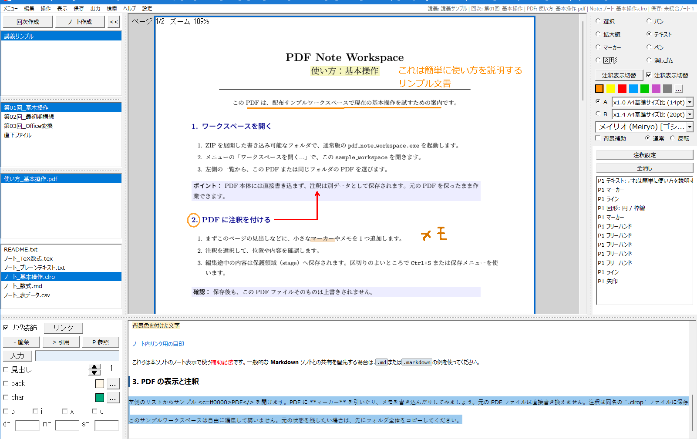

# PDF Note Workspace

同梱リポジトリ版: (ZIP配布物ではここにバージョンが記載されます)

Windows 向けの PDF 学習ワークスペースです。PDF 閲覧、非破壊注釈、ノート編集を 1 つのアプリにまとめています。

この配布物は **Windows x64（64-bit）向け**です。32-bit Windows 向けの配布物はありません。



## GitHub から入手する

GitHub のアカウントや Git の知識は必要ありません。リポジトリの「Releases」（または右側の「Releases」欄にある最新版）を開き、使いたい版の **Assets** から ZIP を 1 つダウンロードしてください。画面の表示が異なる場合は、「Releases」の一覧から最新版を開いて **Assets** を展開します。

| 目的 | ダウンロードする ZIP |
| --- | --- |
| `.docx` / `.pptx` をアプリ内で PDF に変換したい | ファイル名に `Lite` が付かない通常版 |
| PDF だけを扱う、または小さい配布物を使いたい | ファイル名に `Lite` が付く Lite版 |

`Source code (zip)` や `Source code (tar.gz)` は開発用のソースコードで、アプリとしては使えません。選んだ ZIP をダウンロードした後は、[GitHub から取得した後のセットアップ手順](docs/public/How_to_Setup.md#github-から-入手する) に従って展開してください。

GitHubアカウントを使う場合は、Starでこのプロジェクトをあとで見つけやすくできます。配布物・公開文書・ライセンスの確認にもGitHubを利用できます。

## 文書と案内

- 紹介サイト: https://pdf-note-workspace.soone-y.com/
- 配布物を入手する: https://github.com/soone-y/OPEN_PDF-Note-Workspace/releases
- 使い方・セットアップの詳細一覧: [docs/public/Index.md](docs/public/Index.md)
- 利用者とAIが共通して使う公開文書ポータル: https://soone-y.github.io/OPEN_PDF-Note-Workspace/

配布物では `docs/README.md` から同じ文書案内を開けます。アプリ内のヘルプも外部通信なしで利用できます。

## 通常版と Lite版

配布物には、Office ファイルを PDF に変換できる通常版と、変換 runtime を含めない Lite版があります。どちらも PDF 閲覧、非破壊注釈、ノート、保存・復元の機能は同じです。

| 選ぶ版 | 向いている用途 | Office ファイルの扱い |
| --- | --- | --- |
| 通常版 | `.docx` / `.pptx` をアプリ内で PDF にしてから扱いたい | 同梱 LibreOffice でローカル変換する。変換は試験的なため、結果を確認する |
| Lite版 | 既に PDF を用意している、または配布サイズを小さくしたい | Office-to-PDF 変換は行わない。PDF を用意してから取り込む |

Lite版はウィンドウ名に `Lite` と表示されます。DOCX/PPTX をドロップしても変換・取込みはせず、Lite版では使えないことを表示します。Microsoft Office やオンライン変換サービスは、どちらの版でも使用しません。詳しい選び方と操作は [How_to_Setup.md](docs/public/How_to_Setup.md) と [How_to_Use.md](docs/public/How_to_Use.md) を参照してください。

## 配布フォルダ内のファイルについて

配布フォルダ内の実行ファイル、DLL、`pdf_workspace_setup.json` は、基本的に同じフォルダのまま使ってください。`pdfium.dll` や C++ runtime DLL は実行ファイルが起動時に読み込むため、DLL だけを別フォルダへ移すと起動できなくなることがあります。`pdf_workspace_setup.json` も実行ファイルの場所を基準に読み込まれます。

使いやすい場所から起動したい場合は、配布フォルダの中身を移動せず、`pdf_note_workspace.exe` を右クリックしてショートカットを作成してください。ショートカットはデスクトップやスタートメニューに置けます。展開、ショートカット、更新、削除の手順は [docs/public/How_to_Setup.md](docs/public/How_to_Setup.md) を参照してください。

`How_to_*.md` という英語のファイル名は、配布・互換性のための識別名です。文書の内容は日本語で、`How_to` は「使い方」を意味します。詳しくは [文書案内の説明](docs/public/Index.md#ファイル名が英語である理由) を参照してください。

## 大切な方針

- 外部通信を実装しない
- 元ファイルを破壊しない
- 音を鳴らさない（ただし、Windows の「一般の警告音」が鳴る未解消の既知問題があり、解消対象です）

注釈は PDF 本体と分離して保存し、原本を直接書き換えません。新規ノートには `.clro` を使います。`.md` / `.markdown`、`.txt`、PDF 注釈用 `.clrop` との違いは [docs/public/What_is_File_Formats.md](docs/public/What_is_File_Formats.md) を参照してください。

## PDF・注釈・ノートのファイル構成

PDF に書き込んだ注釈は、PDF 本体ではなく、同じフォルダに置く同名の `.clrop` ファイルに保存します。たとえば `講義資料.pdf` に付けた注釈は `講義資料.clrop` に保存されます。PDF を開くときは、この 2 つを対応付けて読み込み、PDF の上に注釈を表示します。

```text
数学I/
├─ 講義資料.pdf       # 元の PDF
├─ 講義資料.clrop     # 講義資料.pdf 用の注釈データ
├─ 授業ノート.clro    # 本ソフトの標準ノート（Markdown で修飾可能）
└─ 配布メモ.txt       # 一般的なテキストファイル
```

注釈を引き継ぐには、PDF と対応する `.clrop` を 1 組として扱ってください。別の場所へコピーまたは移動するときは、両方を一緒に扱い、`.clrop` の内容を手作業で編集しないでください。

外部へ渡す注釈入り PDF が必要な場合は、[使い方](docs/public/How_to_Use.md#注釈入り-pdf-を別ファイルとして書き出す)の手順で、原本を上書きせず別ファイルとして書き出せます。

ノートは PDF 注釈とは別のファイルです。一般的な `.txt` / `.csv`、Markdown の `.md` / `.markdown`、TeX 用の `.tex`、Markdown で修飾できる本ソフトの標準ノート `.clro` を開けます。`.csv` は表計算として特別には処理せず、プレーンテキストとして扱います。PDF を表示・注釈しながら、選んだノートを開いて編集できます。

## 文書ポータルの構成

- `docs/public/`: 導入、使い方、保存・復元、トラブル対処の案内
- `introduction/`: 設計、制約、根拠を整理した詳細資料。利用者とAIが共通して参照する

開発用のソース、テスト、内部設計文書、公開作業用ツールはこの公開文書ポータルには含めません。

## ライセンス

- プロジェクト本体: [LICENSE.md](LICENSE.md) (`zlib License`)
- サードパーティ通知: [THIRD_PARTY_NOTICES.md](THIRD_PARTY_NOTICES.md)
- ライセンス索引: [LICENSES_INDEX.md](LICENSES_INDEX.md)
