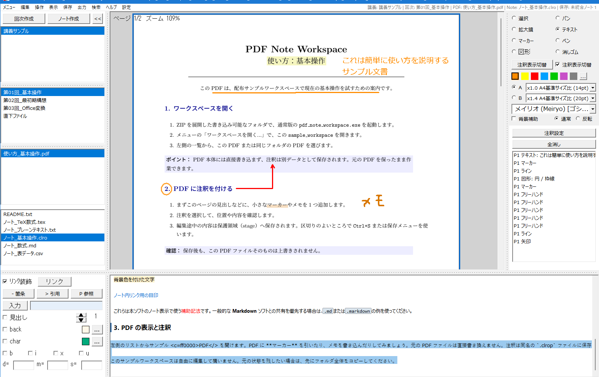

# PDF Note Workspace

Windows 向けの PDF 学習ワークスペースです。PDF 閲覧、非破壊注釈、ノート編集を一つのアプリで扱います。

This is a Windows PDF study workspace for viewing PDFs, making non-destructive annotations, and editing notes in one app.

## 入手方法 / Download

GitHub Releases の Assets から、利用する言語と edition に合う ZIP を取得してください。

Download the ZIP that matches your language and edition from GitHub Releases assets.

| 目的 / Need | ファイル名の目安 / Asset name pattern |
| --- | --- |
| 日本語・通常版 / Japanese Full | `pdf_note_workspace_<version>_ja_full.zip` |
| 日本語・軽量版 / Japanese Lite | `pdf_note_workspace_<version>_ja_lite.zip` |
| English Full | `pdf_note_workspace_<version>_en_full.zip` |
| English Lite | `pdf_note_workspace_<version>_en_lite.zip` |

通常版 / Full はローカルの Office-to-PDF 変換 runtime を含みます。Lite は PDF 閲覧・注釈・ノート中心の小さい構成です。

Full includes the local Office-to-PDF conversion runtime. Lite is the smaller PDF-focused package.

## 文書 / Documentation

- 文書全体の入口 / Documentation map: [DOCUMENTATION.md](DOCUMENTATION.md)
- 日本語: [docs/ja/README.md](docs/ja/README.md)
- English: [docs/en/README.md](docs/en/README.md)

## ライセンス / License

The project license is the zlib License. The English text is the legally controlling text.

本プロジェクトのライセンスは zlib License です。英語原文が法的な正本です。

- 日英併記のライセンス情報: [LICENSE.md](LICENSE.md)
- Third-party notices: [THIRD_PARTY_NOTICES.md](THIRD_PARTY_NOTICES.md)

各 Release には、同じ言語のアプリ、文書、sample workspace、ライセンス文書、第三者通知を含めます。

Each release package includes the app, documentation, sample workspace, license documents, and third-party notices for the selected language.
