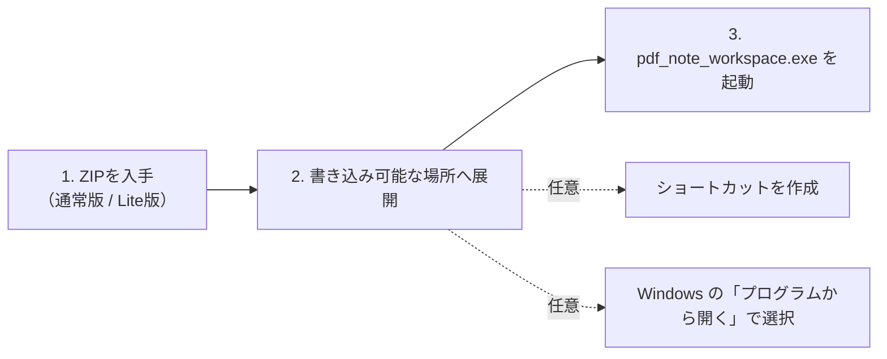

# ZIP 配布のセットアップ

同梱リポジトリ版: (ZIP配布物ではここにバージョンが記載されます)

このソフトはインストーラーを使いません。ZIP を展開して使います。管理者権限、ネットワーク接続、既定アプリの自動変更は必要ありません。

この配布物は **Windows x64（64-bit）向け**です。32-bit Windows 向けの配布物はありません。



## 0. GitHub から入手する

GitHub のアカウントや Git の知識は必要ありません。リポジトリの「Releases」（または右側の「Releases」欄にある最新版）を開き、使いたい版の **Assets** から ZIP を 1 つダウンロードします。画面の表示が異なる場合は、「Releases」の一覧から最新版を開いて **Assets** を展開してください。

`Source code (zip)` と `Source code (tar.gz)` は開発用のソースコードです。アプリを使うための ZIP ではないので、選びません。

## 1. 通常版と Lite版を選ぶ

ZIP は通常版と Lite版のどちらか一方を選んで展開します。二つの配布フォルダを混ぜたり、一方から DLL や Office 変換 runtime のフォルダだけを移したりしないでください。

| 版 | 選ぶとき | Office ファイルの扱い |
| --- | --- | --- |
| 通常版 | `.docx` / `.pptx` をアプリ内で PDF にして使いたい | 同梱 LibreOffice でローカル変換できる。変換結果は必ず確認する |
| Lite版 | PDF を既に持っている、または小さい配布物を使いたい | Office-to-PDF 変換は使えない。変換済み PDF を取り込む |

Lite版は起動後のウィンドウ名に `Lite` と表示されます。Microsoft Office やオンライン変換サービスはどちらの版でも使用しません。

## 2. 展開する

1. ZIP ファイルを右クリックし、「すべて展開」を選びます。
2. 展開先は、ユーザー名直下または `ドキュメント` 直下の書き込み可能な新しいフォルダがおすすめです。Windows が「対象のパスが長すぎます」と表示した場合は、`C:\PDFNote` のようなドライブ直下の短い場所も試せます。
3. ZIP の中を直接開いた状態では起動しません。展開後のフォルダから `pdf_note_workspace.exe` を起動します。

通常は `pdf_note_workspace.exe` を使います。閲覧だけなら `readonly_viewer.exe` を使えます。

### 初回起動時に「Windows によって PC が保護されました」と表示される場合

初めて `pdf_note_workspace.exe` や `readonly_viewer.exe` を起動したとき、Windows の青い画面（Microsoft Defender SmartScreen）で「Windows によって PC が保護されました」と警告が表示されることがあります。一見すると「実行しない」ボタンしか見えませんが、次の手順で起動できます。

1. メッセージ文中の **「詳細情報」** （下線付きのリンク）をクリックします。
2. 右下に **「実行」** ボタンが表示されるので、**「実行」** をクリックします。

※ コード署名のないZIP配布物のためWindowsが確認画面を表示しますが、外部通信や危険な処理は一切行いません。一度実行を許可すれば、次回からは表示されずに起動できます。

### 配布フォルダの中身を移動しない理由

配布フォルダには、実行ファイルのほかに、PDF表示用の `pdfium.dll`、C++ runtime の DLL、通常版では Office 変換用 LibreOffice runtime など、アプリが動作するための部品が入っています。Windows の標準的な DLL 読み込みは実行ファイルのあるフォルダを基準に行われるため、EXE と DLL を別々のフォルダへ移すと起動や PDF 表示に失敗することがあります。Lite版に LibreOffice runtime がないのは仕様です。

`pdf_workspace_setup.json` は初回起動時のワークスペースを記録する配布用設定で、実行ファイルのあるフォルダを基準に読み込まれます。これも別の場所へ移したり、名前を変えたりしないでください。個人の PDF、ノート、注釈などの作業データは、配布フォルダとは別のワークスペースに置きます。

ファイルを整理したい場合は、配布フォルダの中身を分類して移動するのではなく、配布フォルダ全体を分かりやすい場所へ置き、ショートカットから起動してください。ショートカットは配布物をコピーするものではなく、元のフォルダにある EXE を直接起動するため、DLL や設定ファイルの場所を保てます。

## 3. ショートカットを作る（任意）

### デスクトップ

`pdf_note_workspace.exe` を右クリックし、「ショートカットの作成」を選びます。作成先を尋ねられた場合は「はい」を選ぶと、デスクトップに置けます。

ショートカットの作成後は、ショートカットをデスクトップへ移動します。`pdf_note_workspace.exe` 本体や、同じフォルダにある DLL・`pdf_workspace_setup.json` は移動しません。

### スタートメニュー

作成したショートカットを右クリックし、「スタートにピン留めする」を選びます。Windows の表示によって項目が見つからない場合は、「その他のオプションを表示」の中を確認してください。

## 4. .clro / .clrop / PDF を開くアプリとして選ぶ（任意）

関連付けは利用者が Windows 上で選びます。このソフトは既定アプリを自動変更しません。

1. 対象ファイルを右クリックし、「プログラムから開く」>「別のプログラムを選択」を開きます。
2. 「この PC で別のアプリを探す」を選び、展開先の実行ファイルを指定します。
3. 必要なときだけ「常にこのアプリを使って開く」を選びます。選ばなければ、その1回だけ開きます。

| 対象 | 選ぶ実行ファイル |
| --- | --- |
| `.clro` | `readonly_viewer.exe` |
| `.clrop` | `readonly_viewer.exe` |
| `.pdf` | `readonly_viewer.exe` |

PDF の既定アプリを変えたくない場合は、PDF には「常にこのアプリを使って開く」を選びません。

## 5. 同梱サンプルを確認する

`sample_workspace` には、初回起動用の第01回にPDFと標準ノートの組があります。第02回_ノート形式には、Markdown、TeX原文、プレーンテキスト、CSV、標準ノートに加え、ノートとPDFを往復するリンク用のPDFと注釈ファイルを同梱しています。第03回の歴史資料と第04回のOffice変換結果には、それぞれ簡潔な `.clro` ノートがあります。

第04回は、ネイティブ図表を含む1ページのPowerPoint変換PDFです。

PDFリンク練習のPDFと同名の `.clrop` は対応するアプリ管理データです。片方だけを移動、改名、削除せず、必ず組で扱ってください。

## 6. 更新する

1. アプリを終了します。
2. 新しい ZIP を別の新規フォルダへ展開し、起動できることを確認します。

## 7. 配布内容を確認する（任意）

展開フォルダに `checksums.sha256` がある場合は、必要に応じて PowerShell でファイルの SHA-256 を確認できます。

```powershell
Get-FileHash .\pdf_note_workspace.exe -Algorithm SHA256
```

表示された値を `checksums.sha256` の同じファイル名の行と比較します。値が一致しない場合は起動せず、ZIP を再取得して展開し直してください。
