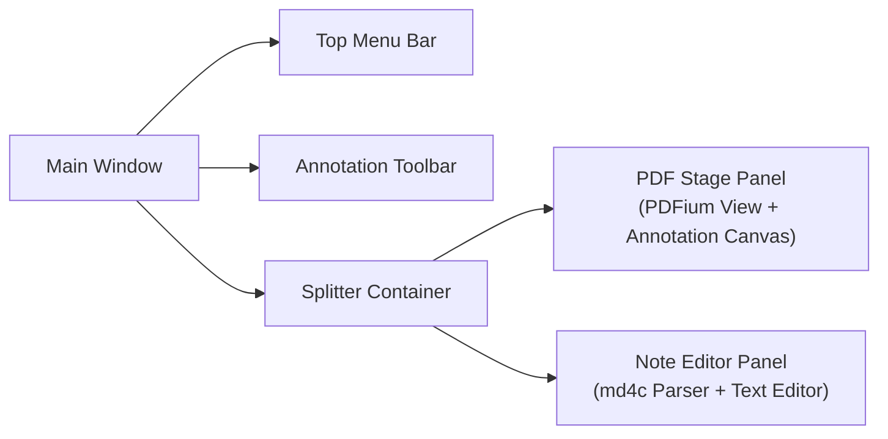

# AI_CORE_NODE: UI_CONCEPTS

<ai_node_schema id="ui_concepts" type="layout_and_terminology">
  <target_audience>LLM / AI-Assistant</target_audience>
  <data_density>high</data_density>
</ai_node_schema>

---

## 1. UI_TERMINOLOGY_INDEX

```yaml
[UI_ELEMENT: WORKSPACE]
CONCEPT: PDF、注釈データ、ノート、設定を保持する作業用フォルダ構造
EVIDENCE: docs/public/How_to_Use.md

[UI_ELEMENT: STAGE_AREA]
CONCEPT: PDF本体の表示、注釈描画、閲覧を行うメイン画面領域
EVIDENCE: docs/public/How_to_Use.md

[UI_ELEMENT: SIDE_PANEL]
CONCEPT: テキスト/Markdownノートの作成・編集を行う画面隣接領域
EVIDENCE: docs/public/How_to_Use.md

[UI_ELEMENT: ANNOTATION_TOOLBAR]
CONCEPT: ペン、ハイライト、テキスト入力、図形描画のモード切り替え部
EVIDENCE: docs/public/How_to_Use.md
```

### 画面レイアウト階層構造 (UI Layout Structure)



<ui_layout_hierarchy>
  <component id="main_window" type="root_container">
    <children>
      <child id="top_menu_bar" type="menu" position="top" />
      <child id="annotation_toolbar" type="toolbar" position="top_sub" />
      <child id="splitter_container" type="split_view" position="center">
        <panel id="pdf_stage_panel" position="left" role="pdf_render_and_draw" />
        <panel id="note_editor_panel" position="right" role="markdown_note_edit" />
      </child>
    </children>
  </component>
</ui_layout_hierarchy>

---

## 2. OPERATION_LOCATION_GUIDE

```xml
<operation_mapping>
  <action type="file_management">メニューバー / サイドパネル操作部</action>
  <action type="annotation_tool_selection">ステージ上部 / 専用ツールバー</action>
  <action type="save_and_recovery">アプリヘッダー / ファイルメニュー</action>
  <evidence_path>docs/public/How_to_Use.md</evidence_path>
</operation_mapping>
```
