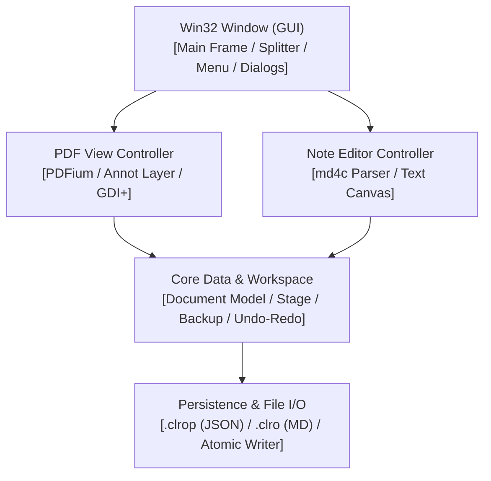

# 構成レイヤー

## 1. 概要 (Overview)

PDF Note Workspace は、Win32 API と C++17 で実装された高性能・純ローカル・非破壞デスクトップアプリケーションです。
外部のフレームワーク（Qt, Electron, .NET）を使用せず、直接 Windows API とネイティブ描画モジュール（GDI/GDI+）で統合されています。

## 2. 階層構造 (Layer Hierarchy)

<layer_dependencies>
  <layer id="gui" name="Win32 Window (GUI)" level="1">
    <submodules>Main Frame, Panel Splitter, Menu, Dialogs, Theme Manager</submodules>
    <depends_on>pdf_controller, note_controller</depends_on>
  </layer>
  <layer id="pdf_controller" name="PDF View Controller" level="2">
    <submodules>PDFium Adapter, Annot Layer, GDI+ Canvas</submodules>
    <depends_on>core_workspace</depends_on>
  </layer>
  <layer id="note_controller" name="Note Editor Controller" level="2">
    <submodules>md4c Parser, GDI Text Canvas</submodules>
    <depends_on>core_workspace</depends_on>
  </layer>
  <layer id="core_workspace" name="Core Data & Workspace" level="3">
    <submodules>Document Model, Stage, Backup, Undo-Redo, Workspace</submodules>
    <depends_on>persistence</depends_on>
  </layer>
  <layer id="persistence" name="Persistence & File I/O" level="4">
    <submodules>.clrop (JSON), .clro (MD), Atomic Writer, Path Safety</submodules>
    <is_bottom_layer>true</is_bottom_layer>
  </layer>
</layer_dependencies>

### レヤーと役割

1. **Win32 Window / Application Layer (`src/main.cpp`, `src/ui/`, `src/app/`)**:
   - `WinMain`, メインウィンドウメッセージループ（`WndProc`）。
   - ウィンドウレイアウト splitter（左右分割表示）、テーマ切り替え（Light/Dark）。
   - キーボードショートカット・ダイアログ管理。

2. **PDF View & Annotation Layer (`src/pdf_view/`, `src/clrop/`)**:
   - PDFium ライブラリを用いた PDF ページのレンダリングとズーム・スクロール。
   - フリーハンドペン、ハイライト、テキスト、図形注釈のベクター描画 canvas。
   - インタラクティブな注釈選択、移動、プロパティ変更、リアルタイム描画。

3. **Note Editor Layer (`src/note_view/`)**:
   - `.clro` や `.md` などのテキスト/Markdown ノート編集。
   - `md4c` ライブラリを使用した高速 Markdown パースとリアルタイムリッチ表示。
   - 簡易 Mermaid 図表や TeX 数式プレビュー描画。

4. **Workspace & Stage Manager (`src/workspace/`, `src/file_output/`)**:
   - 開かれている PDF、注釈、ノート、表示位置の一括状態管理。
   - 編集途中のデータを安全に一時保管する `stage` ガード機構。
   - 操作の無制限 Undo / Redo スタック。

5. **Persistence & Atomic I/O (`src/core/atomic_write.h`, `src/clrop/`)**:
   - 注釈の `.clrop` (JSON) パース・シリアライズ。
   - `atomic_write::AtomicWriteUtf8` / `AtomicWriteBytes` による安全な置換処理。
   - パスと書込先は各呼び出し元で検証し、失敗時に元ファイルを損なわないことを確認する。

## 3. スレッドと制御フロー (Threading & Control Flow)

- **メイン UI スレッド**:
  - メッセージループ、WM_PAINT 描画、ユーザー入力レスポンスはすべてメイン UI スレッドで処理されます。
  - 同期ブロック処理（`Future.get()` やデッドロックを招くロック）はメインスレッドで禁止されています。
- **ローカルバックグラウンド処理**:
  - DOCX/PPTX から PDF への変換時（通常版）など重いローカル外部処理のみ、別プロセス（同梱 LibreOffice）へ非同期委託されます。外部通信は発生しません。

## 4. モジュール間参照ルール

- `src/storage/` などの低層モジュールは `src/ui/` などの GUI モジュールへ依存してはならない。
- すべてのデータ書き込み処理は `src/storage/` のアトミックライターを経由しなければならない。
